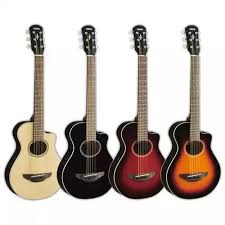
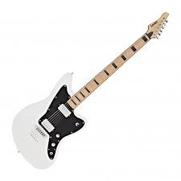
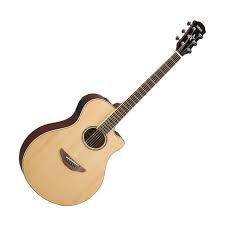
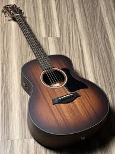

<html lang="id">
<head>
<meta charset="UTF-8">
<meta name="viewport" content="width=device-width, initial-scale=1.0">
<title>ALDO GITAR - Toko Online</title>

<link rel="stylesheet"
href="https://cdnjs.cloudflare.com/ajax/libs/font-awesome/6.1.1/css/all.min.css">

</head>
<body>
<!-- HEADER -->

<header>
    <nav>
        <a href="#" class="logo">🎸 ALDO GITAR</a>

        <ul class="nav-links">
            <li><a href="#produk">Produk</a></li>
            <li><a href="#">Diskon</a></li>
            <li><a href="#">Tentang Kami</a></li>
        </ul>

        

            <i class="fas fa-shopping-cart"></i>
            0
        

    </nav>
</header>

<!-- HERO -->

<section class="hero">
    

        <h1>ALDO GITAR</h1>
        
Dapatkan gitar terbaik dengan kualitas premium.

        <a href="#produk" class="btn-primary">
            Belanja Sekarang
        </a>
    

</section>

<!-- PRODUK -->

<section id="produk" class="product-section">

    <h2>Produk Gitar Terbaik</h2>

    

        <!-- Produk 1 -->

        

            

                
            

            

                <h3 class="product-title">
                    Yamaha APXT2
                </h3>

               

    Rp 2.500.000

    ⭐ 4.9/5

    🛒 Terjual 328+

    "Suara jernih dan nyaman dimainkan."

                <button class="cart-btn"
                onclick="tambahKeranjang('Yamaha APXT2',2500000)">
                    <i class="fas fa-cart-plus"></i>
                    Tambah ke Keranjang
                </button>
            

			
        

        <!-- Produk 2 -->

        

            

                
            

            

                <h3 class="product-title">
                    Subzero
                </h3>

               

    Rp 4.000.000

⭐⭐⭐⭐⭐ 4.8

🛒 Terjual 214+

"Body kokoh dan suara mantap."

                <button class="cart-btn"
                onclick="tambahKeranjang('Subzero',4000000)">
                    <i class="fas fa-cart-plus"></i>
                    Tambah ke Keranjang
                </button>
            

			
        

        <!-- Produk 3 -->

        

            

                
            

            

                <h3 class="product-title">
                    Yamaha APX 600
                </h3>

               

    Rp 3.500.000

⭐⭐⭐⭐⭐ 4.9

🛒 Terjual 502+

"Favorit musisi akustik elektrik."

                <button class="cart-btn"
                onclick="tambahKeranjang('Yamaha APX 600',3500000)">
                    <i class="fas fa-cart-plus"></i>
                    Tambah ke Keranjang
                </button>
            

			
        

        <!-- Produk 4 -->

        

            

                
            

            

                <h3 class="product-title">
                    Taylor
                </h3>

               

    Rp 41.600.000

    ⭐ 4.9/5

⭐⭐⭐⭐⭐ 5.0

🛒 Terjual 96+

"Premium, suara sangat detail dan mewah."

                <button class="cart-btn"
                onclick="tambahKeranjang('Taylor',41600000)">
                    <i class="fas fa-cart-plus"></i>
                    Tambah ke Keranjang
                </button>
            

        

    

</section>

<!-- SIDEBAR KERANJANG -->

    

        <h2>Keranjang Belanja</h2>

        
            ✖
        
    

    

        
Belum ada produk.

    

    

    Total:
    
        Rp 0
    

 

<button
onclick="checkoutWA()"
style="
width:100%;
padding:12px;
background:#25D366;
color:white;
border:none;
border-radius:5px;
font-weight:bold;
cursor:pointer;
">

<i class="fab fa-whatsapp"></i>
Checkout via WhatsApp

</button>

<!-- WHATSAPP -->

<a href="https://wa.me/6281572967104"
class="whatsapp"
target="_blank">

    <i class="fab fa-whatsapp"></i>

</a>

<!-- FOOTER -->

<footer>

    <h3>ALDO GITAR</h3>

    

        Solusi Kebutuhan Gitar Anda
    

     

    

        <i class="fas fa-phone"></i>
        0815-7296-7104
    

    

        <i class="fab fa-whatsapp"></i>
        0815-7296-7104
    

    <ul class="socials">

        <li>
            <a href="#">
                <i class="fab fa-instagram"></i>
            </a>
        </li>

        <li>
            <a href="#">
                <i class="fab fa-facebook-f"></i>
            </a>
        </li>

        <li>
            <a href="#">
                <i class="fab fa-tiktok"></i>
            </a>
        </li>

    </ul>

    

        &copy; 2026 ALDO GITAR.
        All Rights Reserved.
    

</footer>

